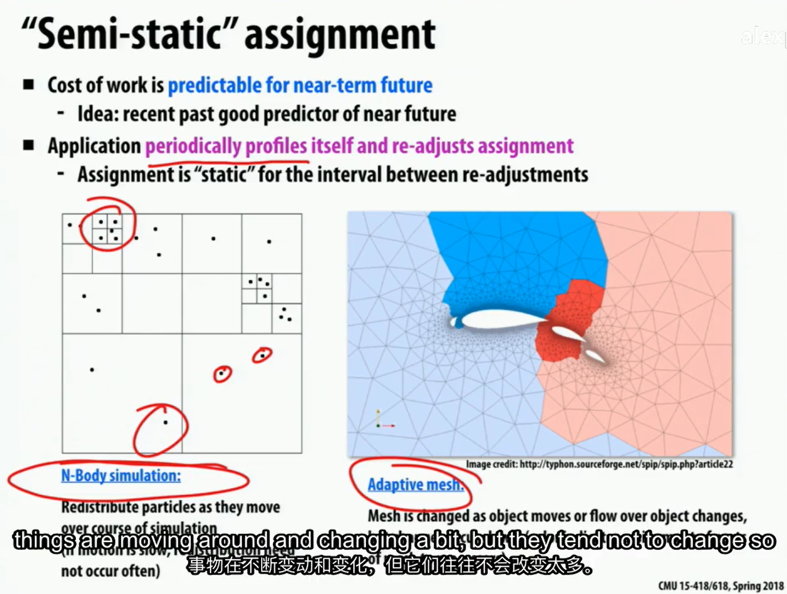
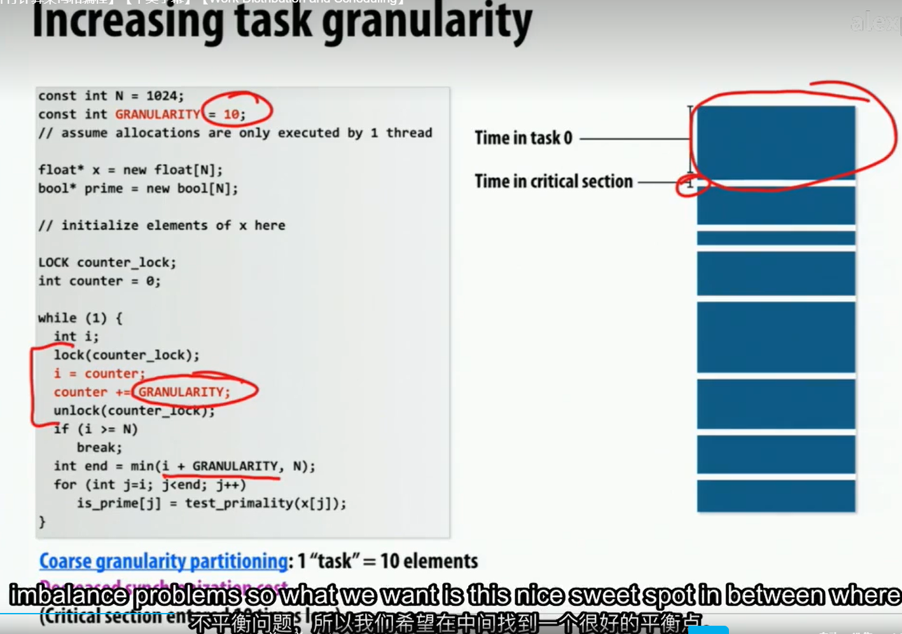

## 三种分配策略的总结

### 静态分配

优点:

- 几乎没有运行时的开销(关于分配)

缺点:

- 不总是均匀的分配任务

什么时候使用:

- (最简单的例子) 当知道每个任务的工作量相当的时候
- 当每个任务的工作量是可预测的,但不一定相等的时候

半静态分配

- 场景: 当工作量会随时间发生改变,当变化比较慢时.(任务量不可预测)

### 动态分配

场景: 当每个任务的工作量或者任务的数量是不可预测的时候

每个计算单元都要去获取任务

但这样的实现, 每次的任务可能会很少,
会使得更多的开销在争夺锁(获取任务的锁)上面.

有一个办法是一次性计算更多的任务.

但分配更多的任务可能会导致负载不平衡.

因此需要找一个平衡, 不花费过多的时间在争夺锁上, 也不会导致负载不平衡.